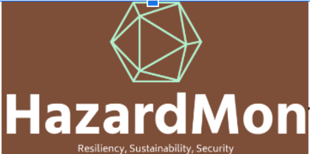

  

---
Starting home page of the HazardMon project, supported by the NSF #2319944: CICI: TCR: A Unified Monitoring Approach to Enhancing the Security and Resiliency of Hazard Workflows on Heterogeneous Infrastructures

## 🔥 Fire Project

**Dataset Preparation and YOLO Timing Experiments**

The Fire project provides scripts to **download datasets**, **generate variants**, and **run YOLO inference timing experiments to understand security challenges**.  

- 📂 [Fire Project Repository](./fire)  
- 📖 [Fire Project README](./fire/README.md)

---

## ⚡ Zapdos Project

**ZAPDOS Source Code**

The Zapdos project contains the implementation of **ZAPDOS**, including both simulation and hardware (Tofino) support.  

### Contents
- `./simulator/` → Haskell implementation of the packet-level simulator of ZAPDOS.  
- `./tofino/` → Tofino implementation, including the P4 data plane program and Haskell runtime.  
- `./data-generation/` → Scripts used in the data-fusion methodology (incomplete).  

### Notes
- Author: **Chris Misa**  
- Last Updated: **2024-05-21**  
- License: See [LICENSE](./zapdos/LICENSE)  
- Status: Work in progress, not fully tested.  
- Contact: [cmisa@cs.uoregon.edu](mailto:cmisa@cs.uoregon.edu)  

Zapdos uses the **nix package manager** with definitions for required environments.  
If definitions are missing or outdated, please update and/or submit a pull request.  

- 📂 [Zapdos Project Repository](./zapdos)  
- 📖 [Zapdos Project README](./zapdos/README.md)

---

## Related Publications and NSF Project:
The repository includes datasets as a part of the following publications:

1. Stateful Triage for Reliable and Secure Wildfire Monitoring at the Edge
Long Tran, River Bartz, Uli Kremer, Ramakrishnan Durairajan and Sudarsun Kannan
In Proceedings of 5th International Workshop on the Internet of Things for Adversarial Environments
co-located with IEEE MILCOM, Los Angeles, CA, October 2025.

2. Are Edge MicroDCs Equipped to Tackle Memory Contention?
Long Tran, River Bartz, Ramakrishnan Durairajan, Uli Kremer and Sudarsun Kannan
In Proceedings of workshop on Hot Topics in Storage and File Systems (HotStorage '25)
co-located with ACM OSDI'25, Boston, MA, July 2025.

3. Redesigning Edge-Centric Micro-Datacenters for Efficient Multitenancy
Sudarsun Kannan, River Bartz, Ramakrishnan Durairajan and Uli Kremer
In Proceedings of workshop on Hot Topics in System Infrastructure (HotInfra)
co-located with ACM SOSP'24, Austin, TX, November 2024.

4. Leveraging Prefix Structure to Detect Volumetric DDoS Attack Signatures with Programmable Switches
Chris Misa, Ramakrishnan Durairajan, Arpit Gupta, Reza Rejaie and Walter Willinger
In IEEE Symposium on Security and Privacy (S&P) (Oakland '24), San Francisco, CA, May 2024.

